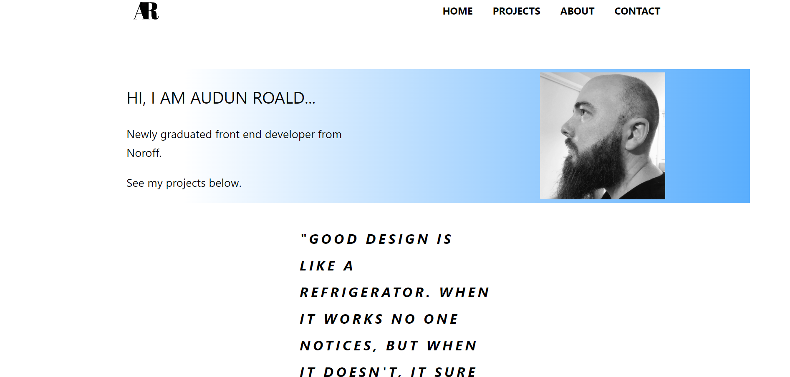

# PORTFOLIO 2

A website to show three of my assignments from my studies at Noroff. This was the last assignment we had, showcasing three projects from the previous two years.

## Description

This website is a portfolio website, intended to present me and showcase three of my projects from the past two years of studying at Noroff. The projects are presented in their own seperate card on the home page, but they also are presented like this on the projects page. Clicking on one of the project will guide you to that project, which will have a bit more in depth explanation with text and images on that projects goals and how it is working.

On the about me page, I give a small presentation of myself and my past working experience and other educations prior to me studying at Noroff.

On the contact page there is just a bit of text accompanied by an image, encouraging the viewr to get in touch.

## Built With

You can list a the tech stack that you've used over here

- [React.js](https://reactjs.org/)
- [Fontawsome](fontawsome.com)
- CSS
  

## How to set up locally

To set up and test out the website locally on your desktop, click the code-button and open the project with gitthub desktop. Then you clone the project to your pc and open it up in VsCode or another coding app your use. You might need to do "npm i", before you can view the website locally in your browser. After that you just type and execute "npm run" and then wait for the create-react-app to load the website.

## Contact

[email address](audunroald@gmail.com)
